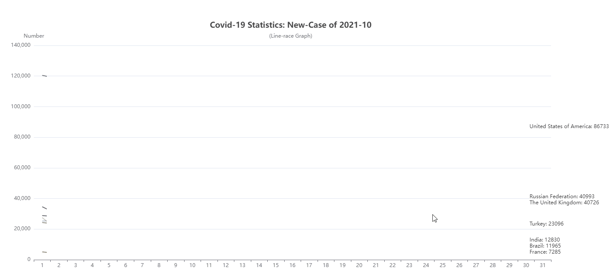

# CS 209A 项目

## 总览

数据可视化是在一种在可视化技术帮助下洞见数据特征的艺术，例如：使用表格、图像或者形式更加复杂的可视化手段如仪表盘。

现在，新冠疫情依旧在全球蔓延，我们可以很容易地获得大量相关的统计数据。我们的任务是实现这些数据的可视化，以便于更好地分析这些数据。在这次项目中，你需要用 *Java* 实现像数据获取和分析这样的后端任务，当然，你可以使用任何程序设计语言（如，*Java*, *jsp*, *html*, *js*, *css*...）

这里提供了一个基本的数据文件 `owid-covid-data.csv`, 你也可以在 http://github.com/owid/covid-19-data 网站上下载它。

请根据下列要求实现数据可视化。

## 基本要求

1. 使用一个合理的数据组织形式来存储数据。

2. 在一个视图中呈现所有数据。

3. 使用 2 种以上的图表展现不同的分析结果。比如，通过不同的图表展示各城市的死亡人数和确认病例。
   比方说：

   
   

4. 报告。

## 进阶要求

1. 自动追踪最新的疫情数据。要从实时更新的网站里获取最新数据哦！
2. 提供自定义的数据源。
3. 在视图里提供一个查找功能，你可以展示搜索和筛选的结果和回退到原始的结果，或者高亮前面的搜索结果。
4. 在视图里提供一个排序功能，比如，根据时间、国家和（死掉的）人数排序。
5. 使用其他的可视化方式，比如，图、映射表、动态图. 
6. 可持久化数据。
7. 通过设置平滑参数，调整展现出来的图像。
8. 用动画展现趋势。

例如：

## 评价标准

基本功能，60 分。

进阶功能：（总分40分）

1. 自动跟踪最新的疫情数据（+5）
2. 多数据源（+5）
3. 搜索功能（+5）
4. 排序功能（+5）
5. map 可视化（+10），其他可视化（+5）
6. 存档（+5），存图（+5）
7. 可变参数与数据调整（+5）
8. 动画展示趋势（+5），设置进度条以实现快进、暂停、回退（+5）

## 报告

项目是开放性的，所以你得提交一个展示你的成果内容的报告。

最好包括这些内容：

- 项目文件结构，`tree` 命令可以快速生成它。
- 自定义类的成员变量与方法解释。
- 程序的示范（可以考虑截图）

## 提交

请提交两部分东西。

1. 整个项目文件
2. 报告文件

你必须将文件压缩好，并命名为 `StudentID-Name-Project.zip`. 

另外，如果你可以在第 15 周展示你的项目，你可以得到 5 points. 

而且，如果你的项目能被选择在理论课被展示，可以得到 5 ~ 15 points. 

## 资源

WTO COVID-19 Dashboard: https://covid19.who.int/

WTO COVID-19 Data table: https://covid19.who.int/table