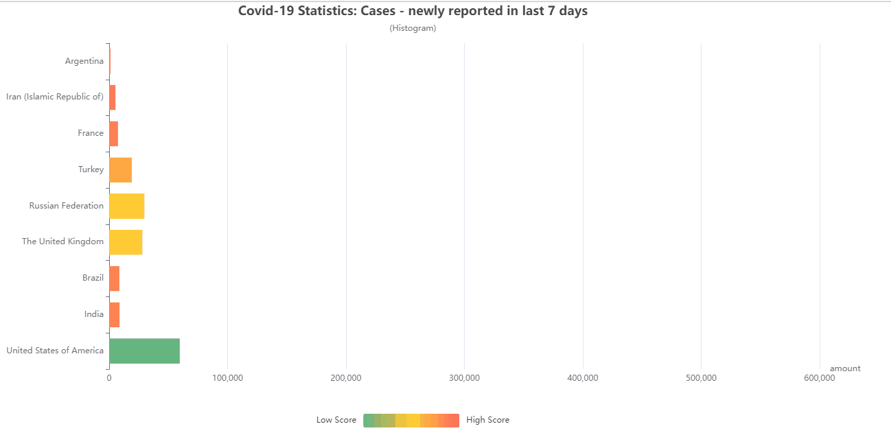
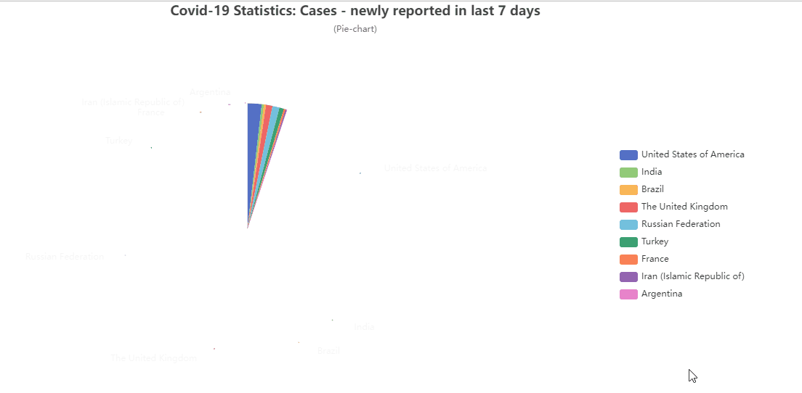

# CS 209A 项目

## 总览

数据可视化是在一种在可视化技术帮助下洞见数据特征的艺术，例如：使用表格、图像或者形式更加复杂的可视化手段如仪表盘。

现在，新冠疫情依旧在全球蔓延，我们可以很容易地获得大量相关的统计数据。我们的任务是实现这些数据的可视化，以便于更好地分析这些数据。在这次项目中，你需要用 *Java* 实现像数据获取和分析这样的后端任务，当然，你可以使用任何程序设计语言（如，*Java*, *jsp*, *html*, *js*, *css*...）

这里提供了一个基本的数据文件 `owid-covid-data.csv`, 你也可以在 http://github.com/owid/covid-19-data 网站上下载它。

请根据下列要求实现数据可视化。

## 基本要求

1. 使用一个合理的数据组织形式来存储数据。

2. 在一个视图中呈现所有数据。

3. 使用 2 种以上的图表展现不同的分析结果。比如，通过不同的图表展示各城市的死亡人数和确认病例。
   比方说：

   
   

4. 报告。

## 进阶要求

1. 自动追踪最新的疫情数据。要从实时更新的网站里获取最新数据哦！
2. 提供自定义的数据源。
3. 在视图里提供一个查找功能，你可以展示搜索和筛选的结果和回退到原始的结果，或者高亮前面的搜索结果。
4. 在视图里提供一个排序功能，比如，根据时间、国家和（死掉的）人数排序。
5. 使用其他的可视化方式，比如，图、映射表、动态图. 
6. 可持久化数据。
7. 通过设置平滑参数，调整展现出来的图像。
8. 用动画展现趋势。

例如：


## 评价标准

基本功能，60 分。

进阶功能：（总分40分）

1. 自动跟踪最新的疫情数据（+5）
2. 多数据源（+5）
3. 搜索功能（+5）
4. 排序功能（+5）
5. map 可视化（+10），其他可视化（+5）
6. 存档（+5），存图（+5）
7. 可变参数与数据调整（+5）
8. 动画展示趋势（+5），设置进度条以实现快进、暂停、回退（+5）

## 报告

项目是开放性的，所以你得提交一个展示你的成果内容的报告。

最好包括这些内容：

- 项目文件结构，`tree` 命令可以快速生成它。
- 自定义类的成员变量与方法解释。
- 程序的示范（可以考虑截图）

## 提交

请提交两部分东西。

1. 整个项目文件
2. 报告文件

你必须将文件压缩好，并命名为 `StudentID-Name-Project.zip`. 

另外，如果你可以在第 15 周展示你的项目，你可以得到 5 points. 

而且，如果你的项目能被选择在理论课被展示，可以得到 5 ~ 15 points. 

## 资源

WTO COVID-19 Dashboard: https://covid19.who.int/

WTO COVID-19 Data table: https://covid19.who.int/table

## 基本数据文件相关信息

### 原始信息

#### 国家基本信息

iso_code: ISO country code, 国家代码

continent: 所属大洲

location: 国家或地区

date: 日期

population: 人口总数（人）

population_density: 人口密度

stringency_index: 财政紧缩指数

life_expectancy: 平均寿命（岁）

median_age: 年龄中位数？**//todo**

human_development_index: 人类发展指数

aged_65_older: 65岁以上人数比例

aged_70_older: 70岁以上人数比例

gdp_per_capita: 人均国内生产总值

extreme_poverty: 极端贫穷

handwashing_facilities: 卫生设施

hospital_beds_per_thousand: 医院床位（每1000个医院）？**//todo**

cardiovasc_death_rate: 心血管的死亡率？**//todo**

diabetes_prevalence: 糖尿病患病率

female_smokers: 女性吸烟人数（人）

male_smokers: 男性吸烟人数（人）

#### 疫情相关信息

**以下以「人」为单位：**

total_cases: 总感染病例

total_deaths: 总死亡病例

icu_patients: 进入 ICU 的病例数

hosp_patients: 入院病例数

weekly_icu_admissions: 周进入 ICU 病例数

new_tests: 检测数

total_vaccinations: 接种疫苗数

total_boosters_per_hundred: （疫苗）加强针接种数

excess_mortality_cumulative: 超额死亡累计数

**以下为比例：**

reproduction_rate: 基本传染数，基本再生数。

Tip: 指没有任何防疫作为介入且所有人没有免疫力情况下，一个感染到某种传染病的初发个案，能够把疾病传染给其他多少个人的平均数。
基本传染数通常写作 $R_0$ . 容易发现，该值愈大，即流行病愈难控制。
在没有防疫情况下：

- 若 $R_0 < 1$, 该传染病将逐渐消失。
- 若 $R_0 > 1$, 该传染病会以指数方式散步，成为流行病。
- 若 $R_0 = 1$, 传染病会变成地方性流行病

positive_rate: （检测）阳性率

**其他：**

tests_units: 统计检测次数的单位

### 附加信息

**以下以「人」为单位：**

new_cases: 新增感染病例

new_deaths: 新增死亡病例

total_cases_per_million: 每100万人中的总感染病例

new_cases_per_million: 每100万人中的新增感染病例

total_deaths_per_million: 每100万人中的总死亡病例

new_deaths_per_million: 每100万人中的新增死亡病例

excess_mortality_cumulative_absolute: 超额死亡累计数绝对值

excess_mortality_cumulative_per_million: 每100万人的超额死亡累计数

**以下为比例：**

excess_mortality: 超额死亡率

new_cases_smoothed: 

new_deaths_smoothed: 降噪？**//todo**

new_cases_smoothed_per_million: **//todo**

new_deaths_smoothed_per_million: **//todo**

## 注释规范

在代码中，使用 *JavaDoc* 注释应遵循如下的规范：

- 使用 `/**` 开头，以显式描述该类、方法、成员变量的作用，注释应当写在其解释的对象之前。
- 注释过程中，一般的断句不应该出现换行。任何显示的换行操作前先写下如下代码 `<br>`, 以让支持 html 渲染的设备能够意识到这里进行了显示的换行声明。
- 通过 `<p>` 进行分段，笔者建议在段落结束时直接增加一段 `<p/>` 进行分段。
- 注释的内容应当有一定的层次感，目前大致建议分成两部分，一部分是对象注释头部，概述该对象的用处；后一部分是对该对象用法的详细解释，建议对于具体的方法有足够详细的描述，以便于让调用者知道该方法的用处和（如果有的话）副作用。可以通过 `<blockquote> ... </blockquote>` 增加代码样例以便于使用者增进理解，和增加字数。
- 通过 `{@link package.class(#method/member variable)}` 能够创建一个指向其他类、方法、属性的超链接，以便于调用者增进理解。
- `@see` 注解能够在注释的尾部增加一段参考说明，语义大概同一篇论文的参考文章条目。
- `@deprecated` 表示该方法不推荐使用，将在未来弃用。（这实际上是一种对过去作出承诺的背弃，请不要轻易做出这个决定。）

以下是关于枚举类 `Continent` 的注释，仅供参考：

```java
/**
 * 七大洲<br>
 * <p/>
 *
 * 一个包含了七大洲（亚洲、欧洲...）的枚举类。<br>
 * <p/>
 *
 * 调用 {@link Continent#valueOf(String)} 能够直接获得相应的枚举实例。<br>
 * 例如：<br>
 * <blockquote>
 *     Continent africa = Continent.valueOf("AFRICA");
 * </blockquote>
 * <p/>
 *
 * 调用该方法需要传递相关的对应的枚举实例全名，而不是缺省值、或者其他语言下的翻译。<br>
 * 如果尝试写出以下代码：<br>
 * <blockquote>
 *     Continent 亚洲 = Continent.valueOf("亚洲");
 * </blockquote>
 * 则会得到一个参数不合法的异常回馈：{@link IllegalArgumentException}.
 * <p/>
 *
 * 在 tool 包中提供了一个特殊的解释器实例 {@link tool.Explainer}, 它将提供重载的解释方法 {@link tool.Explainer#getName(Continent)} 用户获取对应语言下的实例解释。<br>
 * <p/>
 *
 * @see tool.Explainer
 */
```


---

*Fri Nov 26 21:57:20 CST 2021*

新增三个特殊的关键字（identifier）对方法进行描述：**构造器**，**更改器**，**访问器**。

- **更改器**方法：该方法将会直接、间接更改其对象的内部信息或行为。
- **访问器**方法：该方法不会更改调用对象的任何信息。
- **构造器**方法：对于不可变对象而言，通过构造一个新的对象来传达「改变」 的信息。

## 接口规范

---

*Sun Nov 28 21:40:21 CST 2021*

添加了一个特殊的数据对象 `data.Data`. 

- 类 `data.Data` 提供了关键字如下的唯一接口：`String fetch(String property)`. 
  具体约定如下：
  - 输入与列名相同的 property 以便获取对象实例的具体属性值。出于方便起见，匹配过程中模糊大小写和下划线/空格符的区别。
  - 如果该对象不存在对应的属性，则返回 `null`, 否则不会返回 `null`. 
- 新增了工具类 `tool.Tool`, 提供了获取文件中 Data 的方法 `List<data.Data> readDataFile(java.io.File file)` 获取文件中所有的数据并汇总成列表。

## 图形界面规范

---

*Tue Dec 7 15:14:14 CST 2021*

新添加了相关的图像处理样例，以便于更好地实现 GUI 显示。

- 新增了 class Launch01, 测试了条形统计图自带的动画效果。
- 新增了 class Launch02, 测试了折线图自带的动画效果。
- 新增了 class Launch03, 测试了折线图与滑动条的联动效果。
- 新增了 class Launch4PopStage, 测试了定时弹窗窗口的实现情形。
- 新增了 class Launch4BallBounce, 测试了简单动画（非即时计算）的效果。


todo: 还需要处理的问题：

- [ ] 实现弹窗的动画特效。
- [ ] 研究即时计算的动画效果。

---

*Tue Dec 7 23:10:38 CST 2021*

新添加了提示框的处理样例，以便于更好地提醒用户使用 GUI. 

- 新增了 class Launch4TipBar, 测试了提示框的显示功能。
- 调整了 class view2.Launch 的相关内容，以便于能够自动从列信息中导出所需要的信息。

---

*Thu Dec 9 20:00:58 CST 2021*

调整了 GUI 的相关设定。

- 新增了提示框出现、消失的动画，并处理了相关的 BUG. 现在可以通过 <kbd>alt</kbd>/<kbd>option</kbd> + <kbd>T</kbd> 快速执行该动画。
- 
